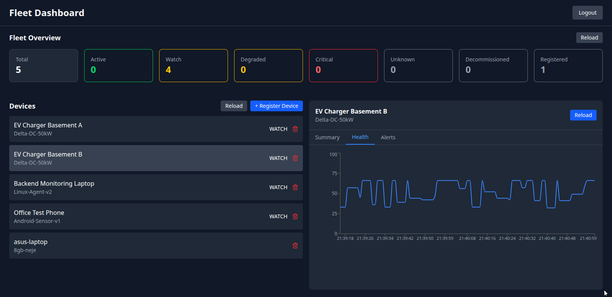
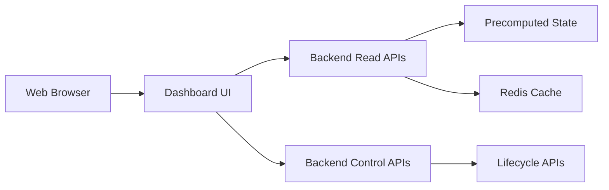

# Asset Fleet Monitoring Dashboard

**Description:**
Operations-focused web dashboard for observing, triaging, and administrating a fleet of monitored devices.
The dashboard is a read-heavy control surface that consumes precomputed state from the backend and exposes it in a human-friendly, decision-oriented UI.

This repository does not handle telemetry, health computation, or alert generation — those concerns live entirely in the backend service.

**[](https://drive.google.com/file/d/11vQUOplxwlXCqHWmwTyyIRvrTvNcixUX/view)**

### Primary Responsibilities

The dashboard exists to answer operator questions quickly:

- Which devices are unhealthy right now?
- What changed recently?
- Is this device degraded or fully down?
- Can I safely decommission or disable it?
- Are alerts flapping or stable?

It intentionally avoids business logic beyond UI-level aggregation and filtering.

### What This Dashboard Is (and Is Not)

**_This is:_**

- A read-optimized admin dashboard
- An operational visibility layer
- A thin client over backend APIs
- A place for controlled admin actions (register, decommission, reactivate)

**_This is NOT:_**

- A telemetry processor
- A health engine
- An alerting system
- A generic end-user app

### Core Capabilities

- Fleet-wide device overview
- Real-time-ish device health status
- Drill-down device detail views
- Alert history inspection
- Device lifecycle actions (admin-only):
  - Register device
  - Decommission device
  - Reactivate device
- Filtering, sorting, and search for large fleets

### UI Architecture & Data Flow



### Tech Stack

- Frontend: React (TypeScript)
- State Management: Query-based
- Styling: Tailwind
- Build Tooling: Vite

### Role Model & Access Control

The dashboard assumes pre-provisioned users, consistent with the backend.

**_Admin_**

- Perform Device Lifecycle changes
- Full fleet visibility

**_Viewer_**

- Read-only access
- Can view devices, health, and alerts
- No destructive actions

There is no public signup and no client-side auth logic beyond token handling.
SSO / RBAC enforcement is backend-owned.

### Local Development

**_Prerequisites_**

- Node.js (LTS)
- Docker (for backend dependency)
- Backend service running locally at http://localhost:8000

**_Clone project and then:_**

```
npm install
npm run dev
```

### Environment Configuration

The dashboard does not manage secrets — tokens are assumed to be injected via dev tooling or reverse proxy in real deployments.

### Design Notes

- Server state is treated as the source of truth.
- UI state is kept minimal and ephemeral.
- Expensive operations (filtering, pagination) are delegated to backend APIs where possible.
- All destructive actions require explicit confirmation to reduce operator error.

### Future Enhancements

The dashboard is intentionally minimal but can evolve to support:

- Live updates via WebSockets or Server-Sent Events
- Saved views and fleet-level presets
- Bulk actions for large fleets
- Embedded operational metrics (latency, ingestion lag)
- Audit visibility

### Notes

- This repository is a frontend systems showcase
- Backend is the authoritative system of record
- UI logic should remain shallow and reversible
- Business rules must not creep into UI
